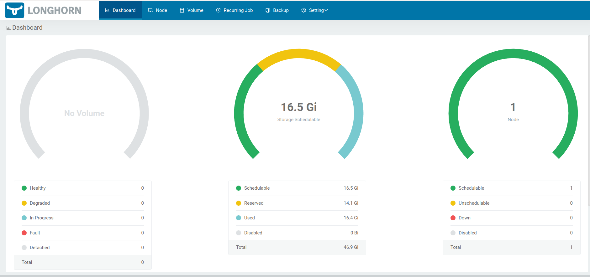

# Instalaciones K3S
En este procedimiento se recogen distintas instalaciones sobre K3S para dotarlo de funcionalidad completa para un entorno de desarrollo y lab. Los pasos se han lanzado contra una **Ubuntu Server 22.04 LTS**.

Algunas de las funcionalidades que se instalarán:
- K3S en single node.
- Almacenamiento con Longhorn.


## Instalación de K3S
Para la instalación de K3S en single mode, basta con lanzar el siguiente comando:
```bash
curl -sfL https://get.k3s.io | sh 
```

## Instalación de Longhorn
Para poder utilizar Longhorn, es necesario que en la máquina esté instalado el paquete de **open-iscsi**. Estas librerías permiten a Longhorn trabajar con los discos conectados a la máquina. Para instalarlo, si no está ya montado en la máquina, basta con lanzar lo siguiente como root:
```bash
apt install open-iscsi
```
Lo siguiente es desplegar Longhorn con kubectl:
```bash
# kubectl apply -f https://raw.githubusercontent.com/longhorn/longhorn/master/deploy/longhorn.yaml
namespace/longhorn-system created
serviceaccount/longhorn-service-account created
serviceaccount/longhorn-support-bundle created
configmap/longhorn-default-setting created
configmap/longhorn-storageclass created
customresourcedefinition.apiextensions.k8s.io/backingimagedatasources.longhorn.io created
customresourcedefinition.apiextensions.k8s.io/backingimagemanagers.longhorn.io created
customresourcedefinition.apiextensions.k8s.io/backingimages.longhorn.io created
customresourcedefinition.apiextensions.k8s.io/backups.longhorn.io created
customresourcedefinition.apiextensions.k8s.io/backuptargets.longhorn.io created
customresourcedefinition.apiextensions.k8s.io/backupvolumes.longhorn.io created
customresourcedefinition.apiextensions.k8s.io/engineimages.longhorn.io created
customresourcedefinition.apiextensions.k8s.io/engines.longhorn.io created
customresourcedefinition.apiextensions.k8s.io/instancemanagers.longhorn.io created
customresourcedefinition.apiextensions.k8s.io/nodes.longhorn.io created
customresourcedefinition.apiextensions.k8s.io/orphans.longhorn.io created
customresourcedefinition.apiextensions.k8s.io/recurringjobs.longhorn.io created
customresourcedefinition.apiextensions.k8s.io/replicas.longhorn.io created
customresourcedefinition.apiextensions.k8s.io/settings.longhorn.io created
customresourcedefinition.apiextensions.k8s.io/sharemanagers.longhorn.io created
customresourcedefinition.apiextensions.k8s.io/snapshots.longhorn.io created
customresourcedefinition.apiextensions.k8s.io/supportbundles.longhorn.io created
customresourcedefinition.apiextensions.k8s.io/systembackups.longhorn.io created
customresourcedefinition.apiextensions.k8s.io/systemrestores.longhorn.io created
customresourcedefinition.apiextensions.k8s.io/volumes.longhorn.io created
clusterrole.rbac.authorization.k8s.io/longhorn-role created
clusterrolebinding.rbac.authorization.k8s.io/longhorn-bind created
clusterrolebinding.rbac.authorization.k8s.io/longhorn-support-bundle created
service/longhorn-backend created
service/longhorn-frontend created
service/longhorn-conversion-webhook created
service/longhorn-admission-webhook created
service/longhorn-recovery-backend created
service/longhorn-engine-manager created
service/longhorn-replica-manager created
daemonset.apps/longhorn-manager created
deployment.apps/longhorn-driver-deployer created
deployment.apps/longhorn-recovery-backend created
deployment.apps/longhorn-ui created
deployment.apps/longhorn-conversion-webhook created
deployment.apps/longhorn-admission-webhook created
```
Se puede comprobar cómo va el proceso de despliegue, para ello, se revisará la creación de pods asociados:
```bash
# kubectl get pods --namespace longhorn-system --watch
NAME                                              READY   STATUS              RESTARTS   AGE
longhorn-conversion-webhook-66f5fdf65b-kt2bg        1/1   Running             0          3m3s
longhorn-conversion-webhook-66f5fdf65b-lp5ft        1/1   Running             0          3m3s
longhorn-recovery-backend-5f5849bb7c-4b9f6          1/1   Running             0          3m3s
longhorn-recovery-backend-5f5849bb7c-95lx2          1/1   Running             0          3m3s
longhorn-ui-7dcbf6bbdc-t6s6r                        1/1   Running             0          3m3s
longhorn-ui-7dcbf6bbdc-97rbj                        1/1   Running             0          3m3s
longhorn-admission-webhook-99c7876bf-5sq78          1/1   Running             0          3m2s
instance-manager-e-bb53c72c943487f682bec47298c7078e 0/1   ContainerCreating   0          2m2s
engine-image-ei-b907910b-jv2dp                      0/1   ContainerCreating   0          2m2s
longhorn-manager-v9xhh                              1/1   Running             0          3m3s
instance-manager-r-bb53c72c943487f682bec47298c7078e 0/1   ContainerCreating   0          2m2s
longhorn-admission-webhook-99c7876bf-np9zj          1/1   Running             0          3m3s
longhorn-driver-deployer-77655df699-4zttd           1/1   Running             0          3m3s
csi-provisioner-68d785644d-vhgzr                    0/1   ContainerCreating   0          109s
csi-provisioner-68d785644d-jp2c8                    0/1   ContainerCreating   0          109s
csi-provisioner-68d785644d-8pss5                    0/1   ContainerCreating   0          109s
longhorn-csi-plugin-clpx4                           0/3   ContainerCreating   0          108s
csi-snapshotter-588bd6f85d-gjl89                    1/1   Running             0          108s
csi-snapshotter-588bd6f85d-knr4l                    1/1   Running             0          108s
csi-snapshotter-588bd6f85d-hhkp6                    1/1   Running             0          108s
csi-resizer-8558456d59-xl5nq                        1/1   Running             0          109s
csi-resizer-8558456d59-bjwld                        1/1   Running             0          109s
csi-resizer-8558456d59-c6lpb                        1/1   Running             0          109s
csi-attacher-7b5d5ff865-4mtzd                       1/1   Running             0          109s
csi-attacher-7b5d5ff865-mc94t                       1/1   Running             0          109s
csi-attacher-7b5d5ff865-db8wl                       1/1   Running             0          109s
```
El útlimo paso es crear un ingressRoute con Traefik para acceder al frontal web. Para eso se crea un archivo YAML (en este documento se ha llamado **longhorn-ingress.yml**), con el siguiente contenido, para crear el ingress:
```yaml
apiVersion: traefik.containo.us/v1alpha1
kind: IngressRoute
metadata:
  name: longhorn-ui
  namespace: longhorn-system
spec:
  entryPoints:
    - web
  routes:
  - match: Host(`longhorn-k3s-00`)
    kind: Rule
    services:
        - name: longhorn-frontend
          port: 80
```
**Nota**: se debe indicar en el match, el valor de DNS que se pretende usar para el acceso al UI de Longhorn.

Para aplicar esta configuración y desplegar el objeto IngressRoute, y validar que se crea el objeto, se lanza:
```bash
# kubectl apply -f longhorn-ingress.yml 
ingressroute.traefik.containo.us/longhorn-ui created
# kubectl get ingressRoute -n longhorn-system
NAME          AGE
longhorn-ui   5m40s
```
Para entrar en el frontal, en el **/etc/hosts** de la máquina cliente se incluirá una entrada con el nombre indicado en el **match** del yaml anterior, apuntando a la IP del server. Tras esto, desde un navegador, atacando el nombre DNS que se ha puesto en el etc/hosts, se tendrá acceso al portal de Longhorn.

