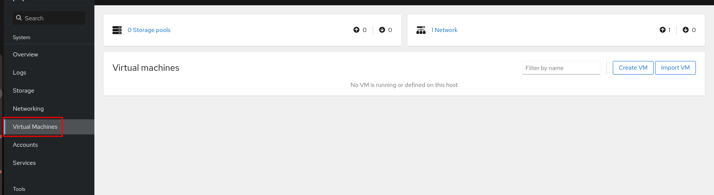

## Pasos para instalar KVM en Ubuntu Server 21.10 con Cockpit
En este documento se recogen los pasos necesarios para instalar el servicio de virtualización de KVM y la herramienta cockpit para gestionar las máquinas virtuales en remoto.

### Pasos para instalar KVM
Los pasos para instalar KVM en Ubuntu Server 21.10, son los siguientes:
1. Lo primero es comprobar si el procesador tiene habilitadas las funciones de virtualización (siempre que el procesador disponga de esta característica). Para ello, el resultado del siguiente comando deber ser mayor a **0**:

```bash
egrep -c '(vmx|svm)' /proc/cpuinfo
```
Otra manera de checarlo es instalar las utilizdades de cpu-checker y ejecutar el comando de chequeo de KVM:
```bash
# sudo apt install cpu-checker
# sudo kvm-ok
INFO: /dev/kvm exists
KVM acceleration can be used
```
Nos dirá si el procesador permite el uso de KVM.

2. Se instalan una serie de paquetes necesarios para disponer del servicio de virtualización KVM:
```bash
sudo apt-get install qemu-kvm libvirt-daemon-system libvirt-clients bridge-utils
```
3. Comprobamos que el servicio está arriba y habilitado para arrancar con la máquina:
```bash 
# systemctl status libvirtd.service
● libvirtd.service - Virtualization daemon
     Loaded: loaded (/lib/systemd/system/libvirtd.service; enable; vendor preset: enabled)
     Active: active (running) since Sun 2022-01-09 18:37:40 UTC; 52s ago
TriggeredBy: ● libvirtd-admin.socket
             ● libvirtd-ro.socket
             ● libvirtd.socket
       Docs: man:libvirtd(8)
             https://libvirt.org
   Main PID: 4669 (libvirtd)
      Tasks: 21 (limit: 32768)
     Memory: 8.4M
        CPU: 180ms
     CGroup: /system.slice/libvirtd.service
             ├─4669 /usr/sbin/libvirtd
             ├─4764 /usr/sbin/dnsmasq --conf-file=/var/lib/libvirt/dnsmasq/default.conf --leasefile-ro --dhcp-script=/usr/lib/libvirt/libvirt_leaseshelper
             └─4765 /usr/sbin/dnsmasq --conf-file=/var/lib/libvirt/dnsmasq/default.conf --leasefile-ro --dhcp-script=/usr/lib/libvirt/libvirt_leaseshelper
```
4. Incluir los usuarios que se desee en los grupos de **kvm** y **libvirt** para que puedan lanzar comandos de KVM. Para ello:
```bash
# adduser usuario kvm
Adding user `usuario' to group `kvm' ...
Adding user usuario to group kvm
Done.
# adduser usuario libvirt
Adding user `usuario' to group `libvirt' ...
Adding user usuario to group libvirt
Done.
```
Se abre una nueva sesión con el usuario al que hemos asignado los grupos de KVM, y podemos comprobar que está dentro de los grupos y tiene permisos de ejecución de comandos de KVM, con lo siguiente:
```bash
$ groups
adm cdrom sudo dip plugdev kvm lxd libvirt docker

$ virsh list --all
 Id   Name   State
--------------------
```

### Instalar Cockpit para gestión de máquinas virtuales.
Para instalar cockpit y el módulo de KVM se hará:

1. Instalar **Cockpit**:
```bash
sudo apt install cockpit
```
2. Se habilita el puerto **9090** en le firewall:
```bash
sudo ufw allow 9090/tcp
```
3. Se arranca el servicio, se habilita el servicio de socket para que arranque al inicio de la máquina y se comprueba que está arriba
```bash
$ sudo systemctl start cockpit
$ sudo systemctl enable --now cockpit.socket
$ sudo systemctl status cockpit
● cockpit.service - Cockpit Web Service
     Loaded: loaded (/lib/systemd/system/cockpit.service; static)
     Active: active (running) since Sun 2022-01-09 19:02:07 UTC; 5s ago
TriggeredBy: ● cockpit.socket
       Docs: man:cockpit-ws(8)
    Process: 8986 ExecStartPre=/usr/lib/cockpit/cockpit-certificate-ensure (code=exited, status=0/SUCCESS)
   Main PID: 8987 (cockpit-tls)
      Tasks: 1 (limit: 38163)
     Memory: 688.0K
        CPU: 25ms
     CGroup: /system.slice/cockpit.service
             └─8987 /usr/lib/cockpit/cockpit-tls
```
4. Se cormpueba el acceso al servicio entrando en la URL: https://IP_de_server:9090

5. Se instala el módulo para gestión de máquinas virtuales de KVM en Cockpit:
```bash
sudo apt install cockpit-machines 
```
6. Tras cerrar sesión y volver a entrar en cockpit, se puede ver que ya se dispone de acceso a la parte de gestión de **virtualización** en Cockpit:



